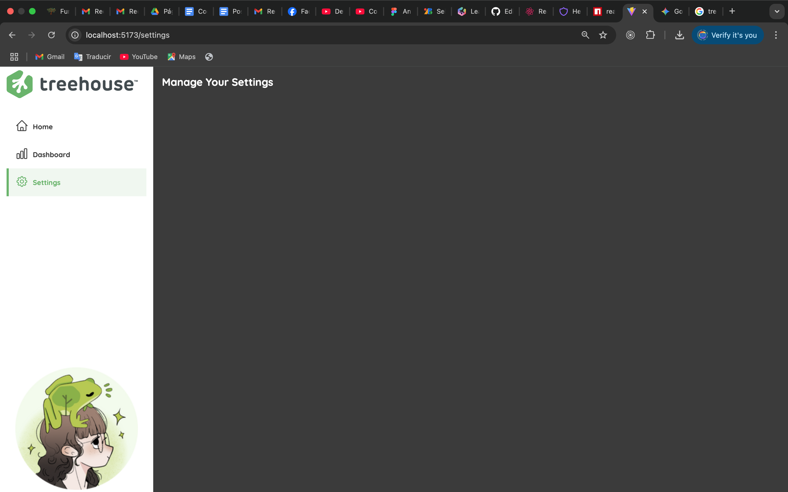

##  Treehouse Menu

> This is a sidebar menu built using react-router-dom V6,
html and css.



## 🔧 Built With

- react-router-dom V6
- HTML
- CSS

## Video Demo
[video demo](https://www.youtube.com/watch?v=sdgj-E-IZn0)


## Getting Started

To get a local copy up and running follow these simple example steps.

- Go to the main page of te repo.
- Press the ```Code``` button and get the repo link.
- Clone it using git.

## Authors

**Cecilia Benitez**

- [@Ceci007](https://github.com/Ceci007)


## 🤝 Contributing

Contributions, issues and feature requests are welcome!

Feel free to check the [issues page](issues/).

## 📝 License

This project is [MIT](lic.url) licensed.
